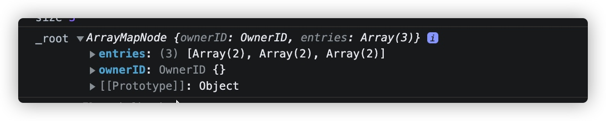
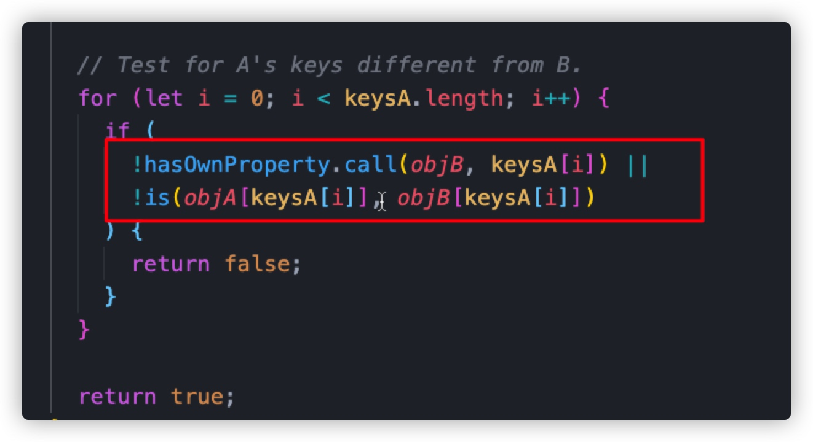

# PureComponent + Immutable
>**pre condition:** setState 会触发组件自身的render渲染,自组件会跟随重新render
 
## PureComponent

1. PureComponent 内部封装了一层`shouleUpdateComponent`, 内部通过`shallowEqual`，对component内部自身的preState/nextState和preProps/nextProps进行了一次浅层比较

    - 如果相等，shouleUpdateComponent则`return false`，值没有改变，不需要进行渲染。
    - 如果不相等， shouleUpdateComponent则`return true`，值有改变，需要进行渲染。

    > 它的缺点就在于，浅层比较的时候，深层对象的更改如果正确的进行监听，比如：`a.b.c.d`被更改了，它比较的时候，只去比较了`preProps.a`和`nextProps.a`，他们两个的引用并没有改变，产生错误判断，认为组件不需要rerender。除非进行deepEqual，深层比较又耗费性能。于是，Immutable出现了。
    
    
## Immutable

1. 如果props等传递的值都是Immutable的，那么它自身改变的时候，无论多深的层级，它的自身的引用会改变，在它自身的_root值也会改变。
    
    - 如下图所示，在自身的keys中有一个_root属性，这就是树的根节点，它改变之后，在`PureComponent`内部执行`shallowEqual`的时候，便会判断出来`props`改变，需要重新渲染，无论多深层级的改变。
    
    

